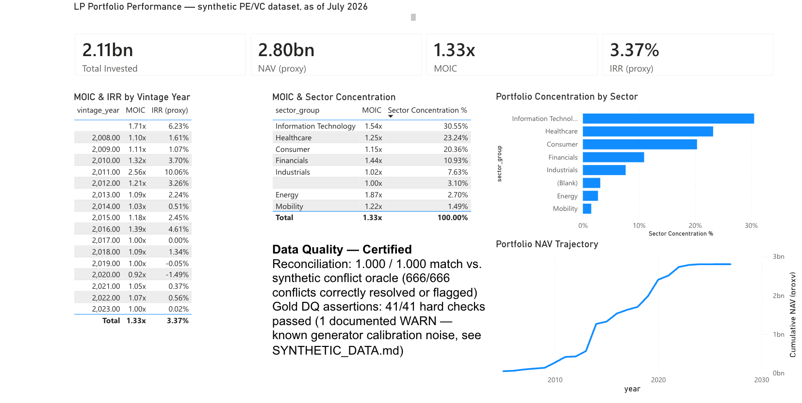

# PE/VC Investment Analytics Platform on Microsoft Fabric

> A reference architecture and working portfolio project for institutional private equity and venture capital analytics, built on Microsoft Fabric.

**Status:** Active development. Architecture v1 complete; core build (conformed layer → Gold star schema → DirectLake semantic model → Power BI report) complete and validated against a live Fabric tenant. AI integration (WS5, fusion agent) complete and validated against live data. Deployment pipelines remain in progress.
**Author:** Vinod Patil — Lead Data & AI Engineer ([LinkedIn](https://www.linkedin.com/in/vinodrpatil/))
**Purpose:** Public portfolio artefact demonstrating Fabric-native architecture for institutional investment workflows.

---

## Why this project exists

Most public Microsoft Fabric content shows generic retail or telemetry use cases. Private market investment workflows — sourcing, screening, due diligence, portfolio monitoring — have a different shape: sparse data, relational density, point-in-time integrity, mixed structured and unstructured sources, and reliability requirements that come from capital being deployed against the outputs.

This project models that shape end-to-end on Fabric. It's not a production system. It's an architectural reference and a working build, intended to demonstrate:

- How OneLake, Lakehouse, Warehouse, and DirectLake compose for investment analytics workloads
- Where graph-aware modelling earns its place over flat relational structures
- How AI integration (Azure OpenAI) layers onto a Fabric data foundation without contaminating data quality
- How governance, lineage, and audit get designed in rather than retrofitted

## Scope and honesty statement

**What this is:**
- A Fabric-native architecture reference for PE/VC analytics
- Working implementation against a representative data model (DealRoom-style external feeds, synthetic internal deal data)
- Public design rationale and decision documentation

**What this is not:**
- A production system serving real institutional capital
- A multi-tenant SaaS platform
- A claim to sovereign-wealth-fund operating scale

The architectural patterns scale. The implementation here is sized for portfolio demonstration, not enterprise deployment.

**A specific simplification — ingestion:** this build uses uploaded Parquet files
for landing, not OneLake shortcuts to external storage (`design_decisions.md`
DD-02). Shortcuts require an external ADLS Gen2 source to point at; the trial
build's synthetic data is uploaded directly. The validation, reconciliation, and
conformance logic downstream is identical either way — only the landing
mechanism differs.

## Architecture at a glance

```
External sources                    Items within pevc-dev (single workspace)
─────────────────                   ────────────────────────────────────────
DealRoom (ndjson)        ─┐
S&P / Capital IQ-style   ─┤
news feeds               ─┤   ┌─────────────────────┐
                          ├──▶│ landing_lakehouse   │  (Shortcuts, no copy)
Internal historical      ─┤   │  OneLake landing    │
deal data                ─┤   └──────────┬──────────┘
                          ┘              │
                                         ▼
                          ┌─────────────────────────────┐
                          │ conformed_lakehouse         │
                          │  Delta Lake (Lakehouse)     │
                          │  • Deterministic validation │
                          │  • Source reconciliation    │
                          │  • Bitemporal modelling     │
                          └──────────────┬──────────────┘
                                         │
                                         ├──────────────────────┐
                                         ▼                      ▼
                          ┌─────────────────────┐   ┌──────────────┐
                          │ Serving — Semantic  │   │ Serving — AI │
                          │ DirectLake → BI     │   │ AI Layer     │
                          │ Power BI semantic   │   │ Azure OpenAI │
                          │ model               │   │ grounded     │
                          └─────────────────────┘   └──────────────┘

Governance plane: Purview-integrated lineage (designed, not wired up), sensitivity
                  labels, item-level access within the domain-organised workspace
```

Everything above runs in a **single Fabric workspace** (`pevc-dev`) at portfolio scope
— see DD-14 in [`docs/design_decisions.md`](docs/design_decisions.md). The boxes are
lakehouses/items within that one workspace, not separate workspaces; workspace-per-layer
with distinct RBAC (DD-10) is documented as the production-scale target, not built here.

Fabric Warehouse is a further documented, deferred extension for analytical SQL serving
— see DD-05 — not provisioned at portfolio scope. Ad-hoc SQL access is via the
Lakehouse SQL endpoint.

See [`docs/architecture.md`](docs/architecture.md) for the full architecture with component-level rationale.

## Key design decisions

The full rationale is in [`docs/design_decisions.md`](docs/design_decisions.md). Headline choices:

| Decision | Choice | Why |
|---|---|---|
| Ingestion to landing | Shortcuts, not copies | Lineage clarity, no duplication, faster freshness |
| Conformed layer storage | Delta on Lakehouse | Schema evolution, time travel, AI workload friendliness |
| Analytical serving | DirectLake + Lakehouse SQL endpoint (Warehouse deferred) | Portfolio-scale query patterns don't need Warehouse's optimiser; no build session provisions it |
| BI semantic layer | DirectLake → Power BI | No import refresh, sub-second on Delta, version-of-truth |
| Graph-aware modelling | Conformed layer with relationship tables, graph view via Spark | Investor/portfolio/co-investment queries are multi-hop |
| Temporal integrity | Bitemporal columns in Delta (effective_date, ingestion_date) | Investment data is point-in-time; "as-of" queries are first-class |
| AI integration | Azure OpenAI against pre-validated conformed data only | LLM never reasons over raw input; data quality enforced upstream |
| Governance | Item-level access + Purview lineage (designed) + sensitivity labels | Audit substrate, not retrofit; workspace-per-layer RBAC is the documented production target (DD-10), single-workspace item separation at trial scope (DD-14) |

## Domain modelling

The conformed layer models the investment domain explicitly. Core entities:

- **Companies** — private and public, point-in-time attributes, sector taxonomy
- **Funding rounds** — with `announced_date`, `effective_date`, valuation, instrument type
- **Investors** — funds, vintages, fund managers, LP relationships where disclosed
- **Investments** — the n-to-n bridge: which investor backed which company in which round, with deal terms
- **People** — founders, board members, fund partners (with relationship history)
- **Deals (internal)** — pipeline stage, IC status, analyst owners
- **Documents** — memos, transcripts, news, with embeddings stored separately

The shape this enables: "Which funds backed B2B SaaS companies at Series B in 2022 that share board members with our existing portfolio?" is one query, not a workflow.

See [`docs/data_model.md`](docs/data_model.md) for the schema and the rationale behind each modelling choice.

## Portfolio report

The domain model, DirectLake semantic model, and measure layer culminate in one report page, built from the LP's seat — not the GP's.



- **KPI row (Total Invested, NAV proxy, MOIC, IRR proxy)** — the four numbers an LP asks for first when they open a portfolio review. `NAV (proxy)` and `IRR (proxy)` both carry an explicit honesty caveat (DD-15, DD-16): this dataset has no periodic fair-value marks, so both are documented approximations, not audited fund figures — a real LP report would need to say the same thing about any GP-supplied NAV that isn't independently marked.
- **MOIC & IRR by vintage year** — the standard way LPs compare fund performance across time: is the 2011 vintage actually outperforming 2019, or does it just look that way because it's had more years to mature? Vintage-year slicing is how that question gets asked honestly.
- **MOIC & sector concentration** — an LP's risk question, not a GP's allocation question: how much of *my* capital sits in one sector, and is that concentration paying off (high MOIC) or just a bet that hasn't been tested yet (low MOIC, high concentration)?
- **Portfolio concentration by sector (chart)** — the same concentration data, shaped for a two-second scan rather than a table read — the visual an LP actually screenshots into an IC memo.

Every number on this page traces backward through a real lineage: landing feeds → Stage B reconciliation (conflict-flagged, not silently resolved) → Stage C bitemporal load → Gold star schema (point-in-time joined) → DirectLake semantic model. Nothing here is a spreadsheet formula sitting on top of a CSV.

For the precise definition, valid grain, and caveats behind every number on this page — including why DPI is deliberately not one of them — see [`docs/measures.md`](docs/measures.md), the measure contract.

## AI layer

Azure OpenAI is integrated against the conformed Delta layer, not the raw ingestion layer. The principle: the LLM reasons over validated, reconciled, source-attributed data — never over raw feeds.

Implementation pattern:

1. Structured retrieval against Delta tables (point-lookup or filtered scan)
2. Optional vector search against document embeddings for unstructured context
3. Prompt construction with explicit source attribution requirements
4. LLM call with structured output schema enforcement
5. Output validation against schema; failures route to human review

The accompanying agentic AI work — the AI Business Analyst Agent — lives in a [separate repository](https://github.com/vinodrpatil-datafusion/ai-business-analyst-agent) and demonstrates a deterministic-core, single-pipeline agentic pattern (statistics computed in code, Azure OpenAI narrating a bounded summary) that would consume this platform's conformed layer.

## Repository structure

```
fabric-pe-vc-analytics/
├── README.md                     ← you are here
├── CLAUDE.md                     Guidance for AI-assisted work in this repo
├── SYNTHETIC_DATA.md             Synthetic data contract and conflict model
├── docs/
│   ├── architecture.md           Full architecture document
│   ├── design_decisions.md       Decision log with rationale
│   ├── data_model.md             Domain schema and modelling rationale
│   ├── measures.md                Measure contract for the semantic model (LP meaning, definitions, caveats)
│   └── governance.md             RBAC, sensitivity, lineage approach
├── infrastructure/
│   ├── workspace_layout.md       Fabric workspace structure
│   └── deployment_pipelines.md   CI/CD approach (in progress)
├── data-generator/                Python package producing synthetic landing feeds
├── sample-data/                   Committed generator output (seed=42, scale=small)
├── ai-integration/                 WS5 fusion agent — Foundry IQ indexing, structured-retrieval agent
├── notebooks/
│   ├── README.md                        Stage map, reconciliation policy, run instructions
│   ├── 01_schema_validation.ipynb       Stage A — structural validation + quarantine
│   ├── 02_reconciliation.ipynb          Stage B — multi-source conflict resolution
│   ├── 03_bitemporal_load.ipynb         Stage C — effective/ingestion dates + SCD2
│   ├── 04_data_quality_assertions.ipynb Stage D — referential integrity certification
│   └── 05_gold_star_schema.ipynb        Stage E — Gold star schema (WS3)
└── fabric/pevc-dev/               Fabric Git integration sync folder — Fabric's own
                                    Commit operation writes here (notebooks, lakehouses,
                                    the DirectLake semantic model, the Power BI report),
                                    one subfolder per workspace item; not hand-edited
```

**Not yet created (planned, not part of the current tree):**
- `pipelines/ingestion/`, `pipelines/transformation/` — Fabric Data Pipeline / Spark definitions; created once Git integration exports pipeline items (see the CI/CD roadmap row below).

## Roadmap

| Stage | Status | Notes |
|---|---|---|
| Architecture v1 | ✅ Complete | Documented in `docs/` |
| Workspace/domain setup | ✅ Complete (as-built ≠ target) | Single workspace `pevc-dev` under the `Investment Analytics` domain (DD-14); the documented workspace-per-layer target (DD-10) isn't provisioned |
| Conformed Delta build with bitemporal modelling | ✅ Complete | 4-stage pipeline (`notebooks/`); reconciliation scored 1.000/1.000 against synthetic conflict oracle |
| Gold star schema (Lakehouse Delta) | ✅ Complete | Grain per DD-15; `notebooks/05_gold_star_schema.ipynb` executed and certified against the live `pevc-dev` tenant |
| DirectLake semantic model | ✅ Complete | `pevc-semantic-model` — 4 Gold tables, relationships, 5 core LP measures (MOIC, IRR proxy per DD-16, NAV proxy, sector concentration, vintage performance) plus 2 supporting DAX measures; full contract in [`docs/measures.md`](docs/measures.md) |
| Power BI report | ✅ Complete | `LP Portfolio Performance` — KPI cards, vintage/sector tables, sector-concentration chart, DirectLake-connected |
| Git integration (Fabric ↔ GitHub) | ✅ Complete | `pevc-dev` workspace connected to this repo, folder `fabric/pevc-dev/` |
| AI integration (fusion agent, WS5) | ✅ Complete | Pattern in DD-13 (`ai-integration/`); Stages A–E all complete and validated against live data — corpus generation, Foundry indexing, structured + document retrieval legs, routing/fusion, and an oracle-based evaluation harness (structured leg 6/6 grounded, document leg 5/6 with a documented citation-accuracy finding) |
| Deployment pipelines (CI/CD via Git) | 📐 Designed, partially implemented | Design in `infrastructure/deployment_pipelines.md`; Git integration is live, Dev/Test/Prod promotion pipelines are not |
| Microsoft Purview lineage integration | 📐 Designed, not implemented | Governance model assumes Purview (see `docs/governance.md`); not wired up in the trial tenant |

## Related work

- **AI Business Analyst Agent** — Agentic AI architecture, complementary to this platform. [Repository](https://github.com/vinodrpatil-datafusion/ai-business-analyst-agent)

## Contact

This is part of an active practice in Enterprise AI & Data Architecture for financial services and regulated industries.

- **Email:** vinodrpatil@outlook.com
- **LinkedIn:** [linkedin.com/in/vinodrpatil](https://www.linkedin.com/in/vinodrpatil/)
- **Practice:** DataFusion Innovation

---

*Last updated: 2026-07-13. This project is under active development; design documents may evolve.*